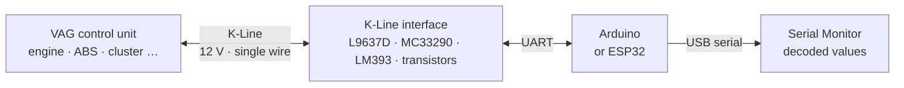

<a id="readme-top"></a>

<div align="center">



# VAG KW1281

**KW1281 diagnostics for VW, Audi, Škoda and SEAT on Arduino and ESP32.**<br>
Open-source firmware that talks to Volkswagen Group control units over the K-Line: it performs the 5-baud wake-up, reads the ECU identification, decodes measuring groups into real values and reads or clears fault codes — plus an ECU simulator for testing without a car.

<p>
  <a href="https://github.com/muki01/VAG_KW1281/stargazers"></a>
  <a href="https://github.com/muki01/VAG_KW1281/network/members"></a>
  <a href="https://github.com/muki01/VAG_KW1281/issues"></a>
  <a href="LICENSE"></a>
  <a href="https://github.com/muki01/VAG_KW1281/commits/main"></a>
</p>

<p>
  <a href="#-hardware"></a>
  <a href="#-hardware"></a>
  <a href="#-the-kw1281-protocol"></a>
</p>

**[Features](#-features)** · **[Quick Start](#-quick-start)** · **[The Protocol](#-the-kw1281-protocol)** · **[Hardware](#-hardware)** · **[In the Car](#-in-the-car)** · **[FAQ](#-faq)**

</div>

---

## 🌟 Overview

**KW1281** is the diagnostic protocol of Volkswagen Group vehicles from the **1990s to the early 2000s**. It runs on the K-Line, but it is not OBD-II: it has its own wake-up sequence, its own block format and a byte-by-byte handshake that generic scan tools do not speak.

This project implements the tester side of KW1281 on a microcontroller. It is written to be read: the protocol is spread over a handful of small functions, every byte is printed on the debug port, and a simulator lets you study the conversation on the bench.



## ✨ Features

- 🤝 **Complete connection sequence** — 5-baud address byte, sync byte and key bytes, complement acknowledge.
- 🪪 **ECU identification** — part number and component description as text.
- 📊 **Measuring groups** — request any group and get named values with units; more than 180 value types are decoded.
- 🔎 **Group scan** — find out which of the 256 groups a control unit supports.
- ⚠️ **Fault codes** — read the stored codes with their status byte, and clear them.
- 🧪 **ECU simulator** — the same board can play the control unit, answering with responses recorded from real cars.
- 👂 **Sniffer mode** — print raw K-Line traffic for analysis.
- 🐞 **Verbose debug output** — every block in both directions, with its counter.

## 🧰 What Is in the Repository

| Sketch | Purpose |
| :-- | :-- |
| [`VAG_KW1281`](VAG_KW1281) | The main firmware: tester, simulator and sniffer in one, selected with `MODE`. |
| [`Basic_Communication_Test`](Basic_Communication_Test) | The smallest working example: connect and keep the session alive. Start here. |
| [`Basic_KW1281_Simulator`](Basic_KW1281_Simulator) | A stand-alone ECU simulator for a second board. |

`MODE` in the main sketch selects what the board does:

| `MODE` | Behaviour |
| :-: | :-- |
| `0` | Sniffer — prints raw data from the K-Line |
| `1` | Tester — connects to the control unit and reads data |
| `2` | Simulator — behaves like a control unit |

## 🚀 Quick Start

**1. Build the interface** — any circuit from the [Hardware](#-hardware) section connects the K-Line to your board's UART.

**2. Get the code:**

```bash
git clone https://github.com/muki01/VAG_KW1281.git
```

**3. Open a sketch** in the Arduino IDE — `Basic_Communication_Test` for a first test, `VAG_KW1281` for the full firmware — and set the pins at the top:

```cpp
#define K_Serial Serial1
#define K_line_RX 10
#define K_line_TX 11
```

The two basic sketches include commented AltSoftSerial lines for the Arduino Uno and Nano (RX 8, TX 9).

**4. Upload**, connect to the car with the ignition on, and open the Serial Monitor — 9600 baud for the basic sketches, 250000 baud for the main firmware.

Example output from an Audi A6 2.5 TDI (debug lines omitted):

```text
Trying KW1281
✅ Connection established with car
✅ Reading ECU Info.
ECU Data 1: 4Z7907401B  2.5l/4VTEDC
ECU Data 2: G000
ECU Data 3: SG D09
```

## 📨 The KW1281 Protocol

### 1. Wake-up

The tester sends the **address of the control unit at 5 baud** — one bit every 200 ms — in 7O1 format. Address `0x01` is the engine control unit.

The control unit answers at its normal baud rate with a sync byte and two key bytes:

```text
Tester  ──  01 (at 5 baud)  ──────────────────────────►
ECU     ◄──  55  01  8A      sync byte, key byte 1, key byte 2
Tester  ──  75  ──────────────────────────────────────►   complement of key byte 2
```

### 2. Blocks

After the wake-up, both sides take turns sending **blocks**:

```text
 04    0B    29    01    03
 │     │     │     │     └─ End        always 0x03
 │     │     │     └─────── Data       here: group number 01
 │     │     └───────────── Title      what the block is — 0x29 = read group
 │     └─────────────────── Counter    incremented with every block
 └───────────────────────── Length     number of bytes that follow
```

### 3. Byte handshake

This is what makes KW1281 special: **every byte except the last one is acknowledged**. The receiver answers each byte with its bitwise complement before the next byte is sent.

```text
Tester   04      0B      29      01      03
ECU          FB      F4      D6      FE
```

### 4. Keep-alive

The session only stays open while blocks keep flowing. When the tester has nothing to ask, it sends an **acknowledge block** (`0x09`) and the control unit answers with one of its own.

### Block titles

| Title | Direction | Meaning |
| :-- | :-: | :-- |
| `0x00` | Tester → ECU | Request ECU identification |
| `0x05` | Tester → ECU | Clear fault codes |
| `0x06` | Tester → ECU | End communication |
| `0x07` | Tester → ECU | Read fault codes |
| `0x09` | Both | Acknowledge |
| `0x29` | Tester → ECU | Read measuring group |
| `0xE7` | ECU → Tester | Measuring group values — 3 bytes per value: type, A, B |
| `0xF6` | ECU → Tester | ASCII text, used for the identification |
| `0xFC` | ECU → Tester | Fault codes — 3 bytes per code: code high, code low, status |

`Codes.h` also defines the requests for basic settings (`0x28`), actuator tests (`0x04`) and reading RAM, ROM and EEPROM (`0x01`, `0x03`, `0x19`).

### Measuring values

Each value in a group arrives as three bytes: a **type** that selects the formula and two data bytes **A** and **B**. The firmware holds a table of more than 180 types with their names and units — engine speed, temperatures, injection quantity, air mass, boost pressure and so on.

## 🔧 Hardware

K-Line is a single-wire, 12 V bus and cannot be connected directly to a microcontroller pin. Each of these circuits does the level shifting; pick the one that suits your project.

### Transistor-based


A simple, low-cost interface for basic builds. **R6** is sized for **3.3 V** microcontrollers; for a **5 V** board, change **R6** to **5.3 kΩ**.

### Comparator-based


A cheap comparator such as the **LM393** gives a clean digital level with well-defined thresholds and better noise immunity than the transistor design.

### Dedicated automotive transceivers

<table>
  <tr>
    <td width="50%"></td>
    <td width="50%"></td>
  </tr>
  <tr>
    <td></td>
    <td></td>
  </tr>
</table>

Purpose-built ISO 9141 transceivers — **L9637D, MC33290, Si9241, SN65HVDA195** — with built-in level shifting and protection. The most reliable option and the right choice for permanent designs.

### Default pins

| Function | ESP32 | Arduino Uno / Nano |
| :-- | :-: | :-: |
| K-Line RX | GPIO 10 | D8 (AltSoftSerial) |
| K-Line TX | GPIO 11 | D9 (AltSoftSerial) |
| Status LED (WS2812) | GPIO 21 | — |

## 🚗 In the Car

A custom-built device connected directly to the engine control unit of an **Audi A6 2.5 TDI (2001)**, a **Bosch EDC15VM+**, reading live data:


On the bench you connect straight to the control unit's connector. To find the pins, look up the pinout of your ECU model — this is the one used here:


`Codes.h` contains responses recorded from this car and from a **VW Golf 3 1.6**; the simulator replays them.

## ❓ FAQ

<details>
<summary><b>Is KW1281 the same as OBD-II or KWP2000?</b></summary>

No. All three can share the same K-Line, but they are different protocols. OBD-II (ISO 9141-2 / KWP2000) is the legislated, generic interface; KW1281 is Volkswagen's own earlier protocol with block framing and a byte-by-byte handshake. For generic OBD-II over K-Line, see <a href="https://github.com/muki01/OBD2_K-line_Reader">OBD2 K-Line Reader</a>.
</details>

<details>
<summary><b>Which cars use KW1281?</b></summary>

Volkswagen, Audi, SEAT and Škoda models from the early 1990s until the mid-2000s, depending on the control unit. Many cars of that era mix protocols: one module speaks KW1281 while another already uses KWP2000.
</details>

<details>
<summary><b>Can I talk to modules other than the engine?</b></summary>

Yes. The module is chosen by the address sent during the 5-baud wake-up. The firmware uses <code>0x01</code> (engine); change it in <code>initOBD2()</code> to address another control unit.
</details>

<details>
<summary><b>Do I need a car to try it?</b></summary>

No. Flash the simulator on a second board, power both K-Line interfaces from 12 V and connect their K-Line pins to each other. The tester then connects to the simulator as if it were a control unit.
</details>

<details>
<summary><b>Is there a library version?</b></summary>

Yes. The <a href="https://github.com/muki01/OBD2_KLine_Library">OBD2 K-Line Library</a> supports KW1281 next to ISO 9141, KWP2000, DS2 and KW82 behind one API.
</details>

## 🤝 Contributing

Contributions are welcome — especially recorded responses from other control units, corrections to the value table, and tested vehicle reports. Please read the **[Contributing Guide](CONTRIBUTING.md)** and the **[Code of Conduct](CODE_OF_CONDUCT.md)**, then open a [vehicle report](https://github.com/muki01/VAG_KW1281/issues/new/choose) with the make, model, year and module.

## 🔗 Related Projects

This project is part of a family of open-source automotive projects. They share the same hardware approach, so what you build for one carries over to the others.

<table>
  <tr>
    <th colspan="3" align="left">Firmware — flash it and use it</th>
  </tr>
  <tr>
    <td width="30%"><a href="https://github.com/muki01/BMW_IBus_KBus"><b>BMW I-Bus / K-Bus Firmware</b></a></td>
    <td>Phone control and key-fob light functions for the BMW E46, on the ESP32 and Arduino.</td>
    <td width="118" align="center"><a href="https://github.com/muki01/BMW_IBus_KBus/stargazers"></a></td>
  </tr>
  <tr>
    <td width="30%"><a href="https://github.com/muki01/OBD2_K-line_Reader"><b>OBD2 K-Line Reader</b></a></td>
    <td>Scan tool for K-Line cars (ISO 9141-2, KWP2000) with a web dashboard, for the ESP32, ESP8266 and Arduino.</td>
    <td width="118" align="center"><a href="https://github.com/muki01/OBD2_K-line_Reader/stargazers"></a></td>
  </tr>
  <tr>
    <td width="30%"><a href="https://github.com/muki01/OBD2_CAN_Bus_Reader"><b>OBD2 CAN Bus Reader</b></a></td>
    <td>Scan tool for CAN bus cars (ISO 15765-4) with the same web dashboard, for the ESP32.</td>
    <td width="118" align="center"><a href="https://github.com/muki01/OBD2_CAN_Bus_Reader/stargazers"></a></td>
  </tr>
  <tr>
    <td width="30%"><b>VAG KW1281</b><br><sub>you are here</sub></td>
    <td>KW1281 diagnostics for VW, Audi, Škoda and SEAT: ECU information, measuring groups and fault codes.</td>
    <td width="118" align="center"><a href="https://github.com/muki01/VAG_KW1281/stargazers"></a></td>
  </tr>
  <tr>
    <th colspan="3" align="left">Libraries — build your own firmware</th>
  </tr>
  <tr>
    <td width="30%"><a href="https://github.com/muki01/BMW_IBus_KBus_Library"><b>BMW IBus KBus Library</b></a></td>
    <td>Receives, checks and sends BMW I-Bus and K-Bus messages; the library behind the BMW firmware.</td>
    <td width="118" align="center"><a href="https://github.com/muki01/BMW_IBus_KBus_Library/stargazers"></a></td>
  </tr>
  <tr>
    <td width="30%"><a href="https://github.com/muki01/OBD2_KLine_Library"><b>OBD2 K-Line Library</b></a></td>
    <td>K-Line diagnostics behind one API: ISO 9141-2, KWP2000, KW1281, DS2 and KW82.</td>
    <td width="118" align="center"><a href="https://github.com/muki01/OBD2_KLine_Library/stargazers"></a></td>
  </tr>
  <tr>
    <td width="30%"><a href="https://github.com/muki01/OBD2_CAN_Bus_Library"><b>OBD2 CAN Bus Library</b></a></td>
    <td>OBD-II diagnostics over ISO 15765-4 with the ESP32's built-in CAN controller.</td>
    <td width="118" align="center"><a href="https://github.com/muki01/OBD2_CAN_Bus_Library/stargazers"></a></td>
  </tr>
  <tr>
    <th colspan="3" align="left">Interface</th>
  </tr>
  <tr>
    <td width="30%"><a href="https://github.com/muki01/OBD2-Diagnostic-UI"><b>OBD2 Diagnostic UI</b></a></td>
    <td>The web dashboard used by the two OBD2 readers.</td>
    <td width="118" align="center"><a href="https://github.com/muki01/OBD2-Diagnostic-UI/stargazers"></a></td>
  </tr>
  <tr>
    <th colspan="3" align="left">Tools</th>
  </tr>
  <tr>
    <td width="30%"><a href="https://github.com/muki01/Bosch_EDC15_EEPROM_Tool"><b>Bosch EDC15 EEPROM Tool</b></a></td>
    <td>EEPROM tool for Bosch EDC15 engine control units.</td>
    <td width="118" align="center"><a href="https://github.com/muki01/Bosch_EDC15_EEPROM_Tool/stargazers"></a></td>
  </tr>
</table>

## 💼 Custom Development

I design automotive diagnostic tools, firmware and hardware professionally. Whether you need a complete product or only the communication layer, I can help.

| Service | Details |
| :-- | :-- |
| **Protocol implementation** | BMW I/K-Bus, K-Line (ISO 9141-2 / KWP2000), CAN / UDS, VAG KW1281 and other manufacturer-specific protocols |
| **ECU communication & reverse engineering** | Bus sniffing, packet decoding, module control, undocumented ECUs and buses |
| **ECU security access** | Seed-key algorithms and unlock routines for KWP2000 / UDS |
| **Embedded firmware** | Arduino, ESP32, ESP8266, STM32, Raspberry Pi Pico |
| **Custom hardware** | Diagnostic dongles, shields and PCBs designed to your requirements |
| **Companion apps** | Android, iOS and web apps to visualise, log and control your device |

Have a project in mind? Reach out through the [Contact](#-contact) section below.

## 📬 Contact

For custom development, collaboration, sponsorship or ready-made devices:

| Channel | Address |
| :-- | :-- |
| 📧 **Email** | [muksin.muksin04@gmail.com](mailto:muksin.muksin04@gmail.com) |
| 💼 **LinkedIn** | [linkedin.com/in/muksin-muksin](https://www.linkedin.com/in/muksin-muksin/) |
| 🐙 **GitHub** | [@muki01](https://github.com/muki01) |

## ☕ Support the Project

If this project helped you, consider supporting its development:

<p>
  <a href="https://www.buymeacoffee.com/muki01"></a>
  <a href="https://www.paypal.com/donate/?hosted_button_id=SAAH5GHAH6T72"></a>
  <a href="https://github.com/sponsors/muki01"></a>
</p>

## 📈 Star History

<a href="https://star-history.com/#muki01/VAG_KW1281&Date">
  <picture>
    <source media="(prefers-color-scheme: dark)" srcset="https://api.star-history.com/svg?repos=muki01/VAG_KW1281&type=Date&theme=dark">
    
  </picture>
</a>

## ⚠️ Disclaimer

> [!WARNING]
> This is a hobby and educational project provided as is, without warranty. Clearing fault codes, basic settings and actuator tests change the state of the vehicle. Connecting custom hardware to a control unit carries risk; the author is not responsible for any damage to vehicles, ECUs or equipment.

## 📄 License

Released under the **[GNU General Public License v3.0](LICENSE)**.

- You are free to use, study, modify and share this project.
- If you distribute it — on its own or as part of a product or firmware — you must make the complete source available under the same license.

**Closed-source or commercial product?** A separate commercial license is available. Get in touch through the [Contact](#-contact) section.

Copyright © 2025–2026 Muksin Muksin.

---

<div align="center">

Created by [**Muki**](https://github.com/muki01) · If this project helped you, please give it a ⭐

<sub>VAG · KW1281 · KWP1281 · Volkswagen · Audi · Škoda · SEAT · K-Line · Arduino · ESP32 · car diagnostics · fault codes · ECU</sub>

**[⬆ Back to top](#readme-top)**

</div>
